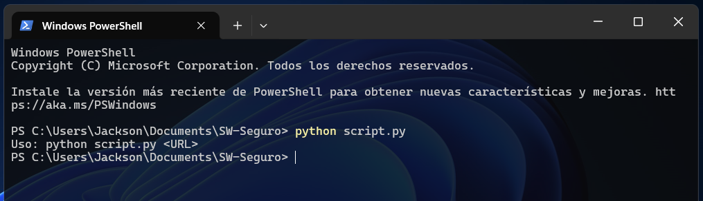
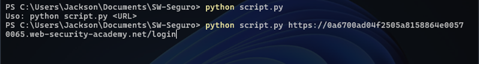
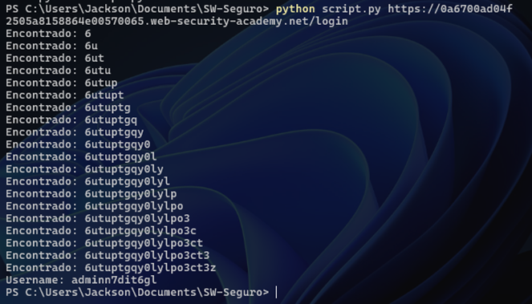
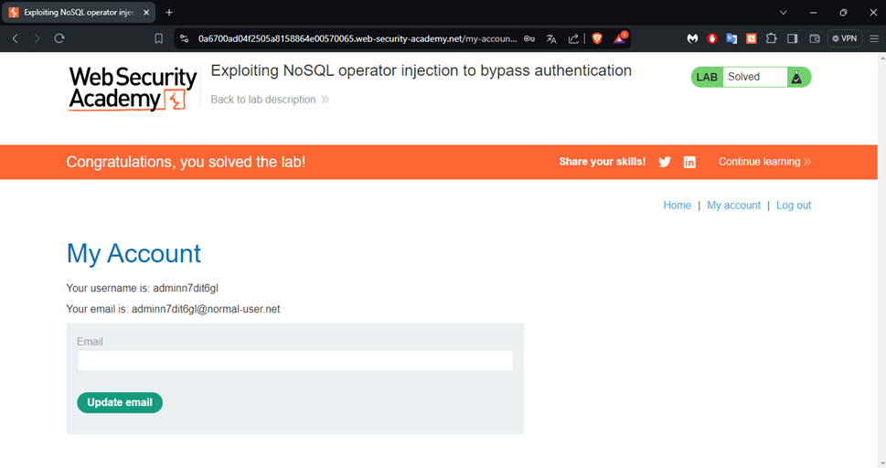

# Script de Python para probar inyecciones NoSQL

### Creado con fines academicos y desarrollado para ser probado en maquinas virtuales de PortSwigger.

## Manual de usuario

Para iniciar con el uso del script es necesario clonar el contenido del repositiorio de Github. Luego, es necesario installar la libreria ***requests*** para hacer las peticiones HTTP al sitio objetivo. Para instalar esta libreria, se lo puede hacer de manera global, es decir en todo el equipo, y también se lo puede hacer dentro de un entorno virtual de python, y de esta manera solo se instalará en ese entorno virtual.

- Para la creación de entornos virtuales de python se puede usar la guía del siguiente sitio: [Entornos virtuales y paquetes en Python](https://docs.python.org/es/3/tutorial/venv.html)
- Luego de crear el entorno virtual se deben copiar el archivo del script dentro de la carpeta que se generó al crear el entorno.

Para iniciar la instalación de la libreria mencionada se debe abrir una terminal y navegar hasta la ubicación donde se ha guardado el script o, a su vez, en la ubicación del entorno virtual. De esta forma se podrá ejecutar el siguiente comando para iniciar con la instalación requerida.
```bash 
pip install requests
```

Luego de culminar con la instalación requerida se puede iniciar con la ejecución del script. Para obtener una pequeña ayuda sobre el funcionamiento del script se puede escribir lo siguiente:
```bash 
python script.py
```

Este comando mostrá un resultado parecido a lo que se muestra a continuación.



Como lo muestra la ayuda del script, para su ejecución es necesario ingresar una URL que corresponda al sitio que se requiere aplicar la prueba de inyección NoSQL para hacer un bypass del login.

De esta forma, se procede a añadir una URL que corresponde a una maquina del sitio PortSwigger el cual provee de servicios vulnerables a este ataque a continuación, se presenta una imagen de lo descrito.



Se presiona la tecla enter para iniciar con la ejecución y despues de algunos minutos se obtendrán los resultados del usuario y password para acceder al sitio.



Finalmente, para comprobar que las credenciales dadas por el script son correctas se puede hacer un inicio de sesión dentro del sitio y verificar el resultado obtenido. En la siguiente figura se muestra el intento de login exitoso usando las credenciales generadas por el script.

